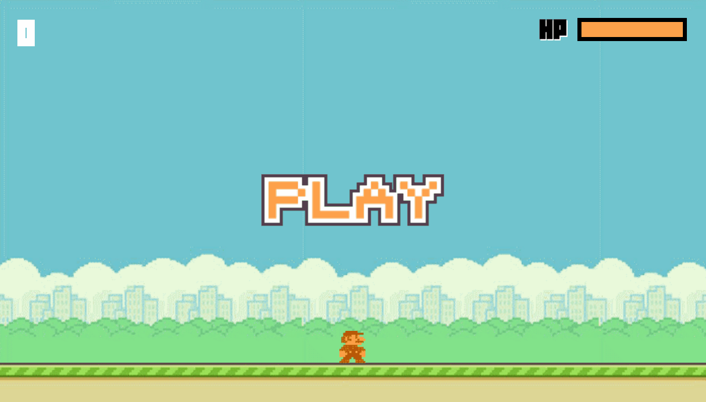

# HTML5 Canvas 遊戲開發超入門

採用 Createjs + Animate cc 來開發一個小遊戲

- 線上展示 DEMO
    - https://mikecheng1208.github.io/Html5GameLiveExample/Mario.html

- 碰撞套件 
    - http://indiegamr.com/easeljs-pixel-perfect-collision-detection-for-bitmaps-with-alpha-threshold/ 

- YouTube 頻道
    - https://www.youtube.com/c/ChengMike

- 直播影片
    -https://www.youtube.com/watch?v=IHyBVK7tvhY